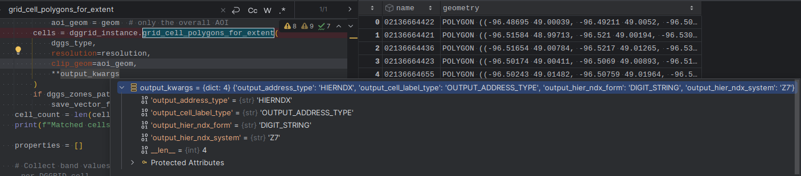

dggrid4py.DGGRIDv8
==================

The DGGRIDv8 class is the class to use with DGGRID 8, for the classical DGGS types as well as for IGEO7.
It selects the hierarchical indexes (Z3, Z7, ZORDER) through the address type ``HIERNDX`` and accepts the additional
parameters of the DGGRID 8 series. The former address type names of the DGGRIDv7 class (e.g. ``Z7_STRING``)
are mapped to ``HIERNDX`` with a ``DeprecationWarning``, see :doc:`../IGEO7`.

The DGGRIDv7 class for DGGRID 7 is deprecated since version 0.6.0.

How to pass additional parameters to DGGRIDv8:

.. currentmodule:: dggrid4py

.. autoclass:: DGGRIDv8
   :members:
   :inherited-members:

   
   .. automethod:: __init__

   
   .. rubric:: Methods

   .. autosummary::

      ~DGGRIDv8.__init__
      ~DGGRIDv8.is_runnable
      ~DGGRIDv8.check_gdal_support
      ~DGGRIDv8.post_process_split_dateline
      ~DGGRIDv8.run

      ~DGGRIDv8.grid_cell_polygons_for_extent
      ~DGGRIDv8.grid_cell_centroids_for_extent
      ~DGGRIDv8.grid_cell_polygons_from_cellids
      ~DGGRIDv8.grid_cell_centroids_from_cellids
      ~DGGRIDv8.grid_cellids_for_extent
      ~DGGRIDv8.cells_for_geo_points
      ~DGGRIDv8.grid_stats_table

      ~DGGRIDv8.dgapi_grid_gen
      ~DGGRIDv8.dgapi_grid_stats
      ~DGGRIDv8.dgapi_grid_transform
      ~DGGRIDv8.dgapi_point_value_binning
      ~DGGRIDv8.dgapi_pres_binning

      ~DGGRIDv8.cells_for_geo_points
      ~DGGRIDv8.address_transform
   
   
   
