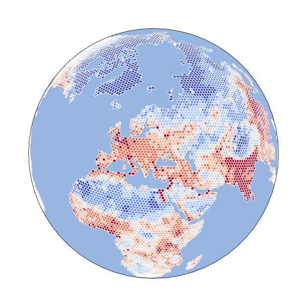

dggrid4py - a Python library to run highlevel functions of DGGRID
=================================================================

|DOI|

|Population Gridded|

GNU AFFERO GENERAL PUBLIC LICENSE

`DGGRID <https://www.discreteglobalgrids.org/software/>`__ is a free
software program for creating and manipulating Discrete Global Grids
created and maintained by Kevin Sahr. DGGRID version 8.42 was released 21. September 2025

-  `DGGRID Version 8.42 on GitHub <https://github.com/sahrk/DGGRID>`__
-  `DGGRID User
   Manual <https://github.com/sahrk/DGGRID/blob/d08e10d761f7bedd72a253ab1057458f339de51e/dggridManualV81b.pdf>`__

Contents
--------

Find the source repository on `GitHub <https://github.com/allixender/dggrid4py>`__ !

.. toctree::

   usage
   IGEO7
   api

Related work:
-------------

Originally insprired by
`dggridR <https://github.com/r-barnes/dggridR>`__, Richard Barnes’ R
interface to DGGRID. However, dggridR is directly linked via Rcpp to
DGGRID and calls native C/C++ functions.

After some unsuccessful trials with ctypes, cython, CFFI, pybind11 or
cppyy (rather due to lack of experience) I found
`am2222/pydggrid <https://github.com/am2222/pydggrid>`__ (`on
PyPI <https://pypi.org/project/pydggrid/>`__) which made apparently some
initial scaffolding for the transform operation with
`pybind11 <https://pybind11.readthedocs.io/en/master/>`__ including some
sophisticated conda packaging for Windows. This might be worth following
up. Interestingly, its todos include “Adding GDAL export Geometry
Support” and “Support GridGeneration using DGGRID” which this dggrid4py
module supports with integration of GeoPandas.

Bundling for different operating systems
----------------------------------------

Having to compile DGGRID for Windows can be a bit challenging. We are
working on an updated conda package. Currently DGGRID v8.42 is available on conda-forge:

.. image:: https://anaconda.org/conda-forge/dggrid/badges/version.svg
   :target: https://anaconda.org/conda-forge/dggrid
   :alt: Latest version on conda-forge

greater context DGGS in Earth Sciences and GIS
----------------------------------------------

Some reading to be excited about:
`discourse.pangeo.io <https://discourse.pangeo.io/t/discrete-global-grid-systems-dggs-use-with-pangeo/2274>`__

Check out the :doc:`usage` section for further information, including
how to :ref:`installation` the project.

.. note::

   This project is under active development.

